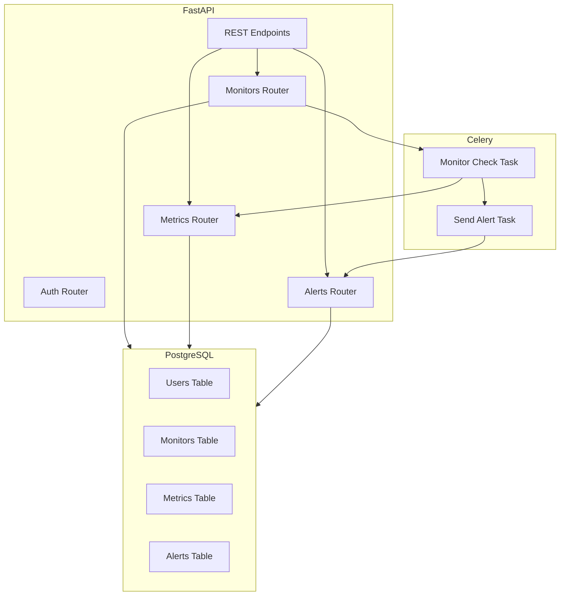

# 📡 Smart API Monitor

A **FastAPI + Celery powered monitoring system** for tracking APIs, websites, and services in real-time.  
It schedules health checks, records metrics, and sends styled alerts (Email/SMS) when a monitor fails or responds slowly.

---

## 🚀 Features

- **User Accounts**
  - Secure authentication with ownership of monitors.

- **Monitors**
  - Create, edit, delete monitors.
  - Flexible check frequency (`frequency_sec`).
  - Auto-rescheduling on server restarts.
  - Per-monitor task management with Celery.

- **Metrics**
  - Tracks uptime, status codes, response latency, and errors.
  - Automatic cleanup available (by monitor or metric ID).

- **Alerts**
  - Triggered on failure, latency breach, or unexpected status code.
  - Sent asynchronously via Celery.
  - Styled Email support.
  - Users can view and delete their alerts (by ID, monitor, or channel).

- **Admin-friendly**
  - Logs task execution details.
  - Robust retry logic with Celery.
  - Works with PostgreSQL (SQLAlchemy ORM).

---

## 🏗️ Architecture



---

## 🛠️ Tech Stack

- **Backend Framework:** FastAPI
- **Task Queue:** Celery with Redis broker
- **Database:** PostgreSQL + SQLAlchemy ORM
- **Auth:** JWT-based authentication
- **Email:** Custom alert service with async delivery
- **Logging:** Structured logs for monitoring

---

```bash

SmartApiMonitor/
├── app/
│   ├── api/              # FastAPI routers
│   │   ├── routes_auth.py
│   │   ├── routes_monitor.py
│   │   ├── routes_metrics.py
│   │   └── routes_alert.py
│   │   └── routes_celery.py
│   ├── core/             # Core configs (celery, scheduler)
│   ├── db.py             # Database session & Base
│   ├── models/           # SQLAlchemy models (User, Monitor, Metric, Alert)
│   ├── schemas/          # Pydantic validation schemas (User, Monitor, Metric, Alert)
│   ├── services/         # Business logic (alerts, monitors)
│   ├── tasks/            # Celery tasks
│   ├── utils/            # Utilities (auth, security, query)
│   ├── config.py         # Configuration
│   └── main.py           # Entry point
│
├── alembic/              # Alembic migrations
├── alembic.ini           # Alembic script
├── tests/                # Pytest suite
├── requirements.txt
└── README.md

```

---

